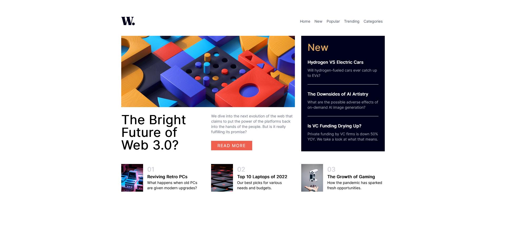
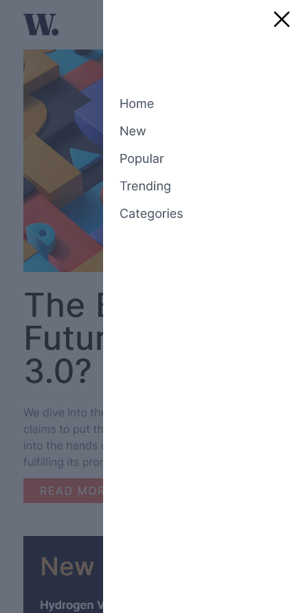

# Frontend Mentor - News homepage solution

This is a solution to the [News homepage challenge on Frontend Mentor](https://www.frontendmentor.io/challenges/news-homepage-H6SWTa1MFl).

## Table of contents

- [Overview](#overview)
  - [Screenshot](#screenshot)
  - [Links](#links)
- [My process](#my-process)
  - [Built with](#built-with)
- [Author](#author)

## Overview

### Screenshot

### Links

- Solution URL: [https://github.com/Beefsupreme21/News-Homepage-Main](https://github.com/Beefsupreme21/News-Homepage-Main)
- Live Site URL: [https://beefsupreme21.github.io/News-Homepage-Main/](https://beefsupreme21.github.io/News-Homepage-Main/)

## My process

### Built with

- HTML5
- Tailwind CSS
- Alpine JS
- Grid

## Author

- Frontend Mentor - [@Beefsupreme21](https://www.frontendmentor.io/profile/Beefsupreme21)